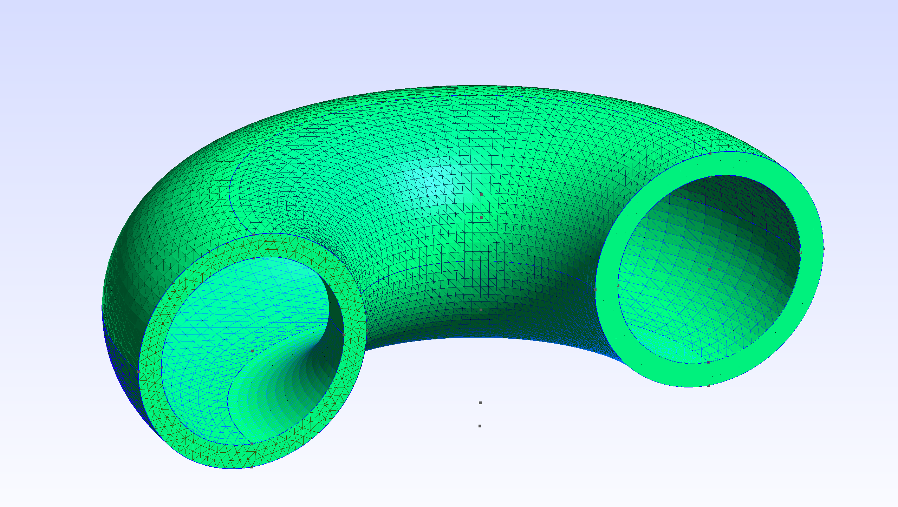
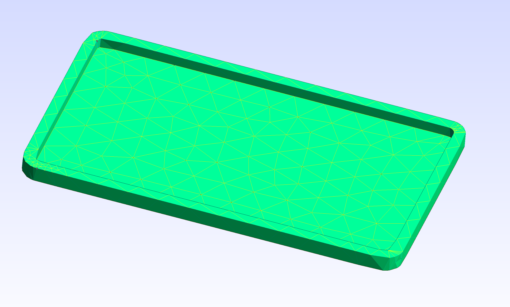

# 🔧 Torus Mesh Lab – Gmsh Geometry and Mesh Generation

This repository provides solutions for the **Torus Mesh Lab**, where we generate and mesh geometries using the Gmsh API. The project covers creating a hollow torus and importing an external STL file to build 3D meshes, fully satisfying both stages of the lab.

## 📚 Lab Overview

### **Stage 1: Create and Mesh a Hollow Torus**
In this stage, a hollow torus geometry (similar to a tokamak chamber) is generated and meshed with **3-4 tetrahedral elements** across the thickness of the torus wall. The code defines the torus geometry programmatically, builds the mesh, and ensures it meets the requirements.

#### Solution:
- **Code**: Generates the torus geometry and builds the mesh using Gmsh.
- **Output**: Generated mesh in gmsh GUI.

### **Stage 2: Import and Mesh an STL File**
In this stage, an STL file is imported, and the code successfully generates a mesh of the external geometry. The STL file was carefully selected to ensure it meshes correctly.

#### Solution:
- **STL File**: An interesting STL object is provided.
- **Code**: Reads the STL file and generates the mesh.
- **Output**: Generated mesh in gmsh GUI.

### **Prerequisites**
- Gmsh installed on your machine.
- C++ compiler 
- The STL file is included for Stage 2.

## 📸 Screenshots

> Mesh generated for the donut.

> Mesh generated for the donut.

> Mesh generated from the Поднос из ксп.

