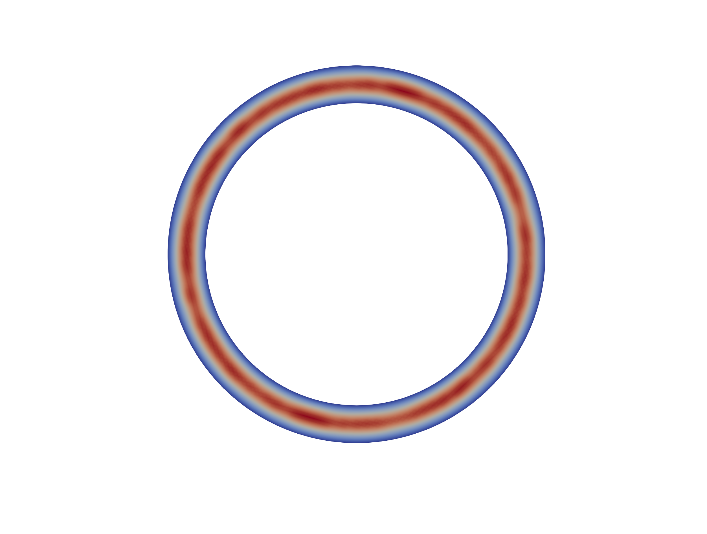

# 🔧 FEniCS Lab – Einite Element Eethods and Eoisson Equation

This repository provides solutions for the **FEniCS Lab - poisson**, where we take some mesh and apply FEniCS possibilities to it. The project does significant geometry changes, as were demanded.

## 📚 Lab Overview

### **Poisson equation: "HELLO WORLD!" of finite element methods**
In this task the sample code, that solve poisson equation is modified to be cool! It is done by transforming square into donut.

#### Solution:
- **Code**: Generates the circular field over the donut, determines donut's boundaries.
- **Output**: Generated pvd.

### **Prerequisites**
- C++ compiler 
- FEniCS. One may use conda to obtain it.
- ParaView. 
- Gmsh to create some funny meshes to overcomplicate them later with poisson equation (optional).

## 📸 Screenshots

> There's a hole in my solution to the Poisson equation. I should fix this. Later maybe.

